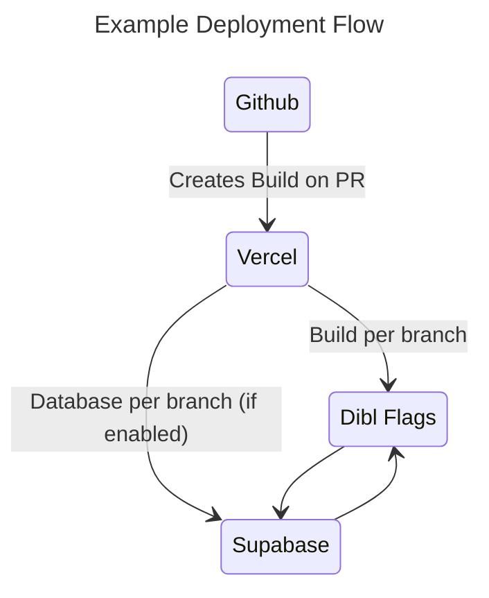

# Dibl Flags 🚩

Open Source Feature flag implementation examples on a Supabase backend.

---

## Using This Repository

This repository serves as example code that can be re-used in your own projects
to set up feature flagging capabilities rather than paying out for a service.

## Features/Examples

- [ ] Basic Boolean flag
- [ ] Basic JSON flag
- [ ] Flag Schedules
- [ ] Flag User Subsets
- [ ] A/B test
- [ ] Feature Preview
- [ ] Flag Editing UI
- [ ] Flag Sign Off Process

---

## Working On This Repository

Either fork the repository or pull it and run locally.

To re-create you will need:

- A Vercel Account
- A Supabase Account

1. Connect Vercel to your fork repo and configure as needed.
2. In Supabase make a project then optionally use Vercel integration to pass environment variables etc. between them.
3. Pull environment variables locally and run migrations against the supabase project.



N.B. Can be easily adapted for any other Postgres database and hosting solution.

### Environment Variables

Ensure you have a `.env.local` file with the required environment variables set out
in `.env.example`.

You will receive errors on running the application if environment variables are not found.

New environment variables must be also configured in `./src/env.js`.

### Running Locally

This project is using [Bun](https://bun.sh/) as our javascript runtime which is different from `npm` or `yarn`.

It is worth making sure your editor has the plugin for [Biome](https://biomejs.dev/). 

#### First time setup install

_N.B._ These commands are meant to be run from the top level of the repository.

```bash
bun install
```

Run the development server:

```bash
bun dev
```

#### Local Supabase

[Official Docs](https://supabase.com/docs/guides/cli/getting-started?platform=npm)

Having installed the local dependencies.

##### Login to Supabase CLI & Link Project

```bash
supabase login
```

```bash
supabase link --project-ref $PROJECT_ID
```

_N.B. Upon linking you will be prompted for your database password._

##### Start Supabase

Make sure Docker has been started e.g. using Docker Desktop.

```bash
supabase start
```

Apply any new migrations.

```bash
supabase db reset
```

##### Managing Database Types

Keep your local types in sync with database changes.

[Official Docs](https://supabase.com/docs/guides/database/api/generating-types)

```bash
supabase gen types typescript --local > src/types/supabase.ts
```

_N.B. This should be run after every new migration is applied & local supabase must be running first._

##### Generate Database Migration

Via diffing local studio changes.

```bash
supabase db diff -f EXAMPLE_FILENAME_SUFFIX
```

##### Create Blank Database Migration

```bash
supabase migration new EXAMPLE_FILENAME_SUFFIX
```

This runs a full local supabase setup in docker and studio on `http://localhost:54323`.

##### Seed Data

[Official Docs](https://supabase.com/docs/guides/cli/seeding-your-database)

Local development will be much easier with data to use and this is where seeding comes into.

Supabase Seeding is generally all done in `supabase/seed.sql`.

##### Stop Supabase

```bash
supabase stop
```

##### Database Branching [Optional]

:warning: This feature of Supabase is in early alpha and requires a pro plan/ incurs cost.

[Official Docs](https://supabase.com/docs/guides/platform/branching#preparing-your-git-repository)

### Committing Code

We use the conventional commits standard to indicate version bumps.

- `fix` — to indicate a bug fix (PATCH) ex. v0.0.1
- `feat` — to indicate a new feature (MINOR) ex. v0.1.0
- `chore` — for updates that do not require a version bump (.gitignore, comments, etc.)
- `docs` — for updates to the documentation
- `BREAKING CHANGE` — regardless of type, indicates a Major release (MAJOR) ex. v1.0.0

### Preparing your PR

#### Versioning

This project uses a library called [Standard-Version](https://github.com/conventional-changelog/standard-version)

Run the release script:

```bash
bun release
```

And push the created changes.

This automatically:

- Generates a changelog from your commit messages.
- Bumps the version numbers in `package.json`.
- Creates a new tags with the version number.

### Deploying A Release

This project uses Vercel for the builds and deployment.

Create a PR, then it will automatically generate a preview build and run the github actions.

On a successful PR merge to the `trunk` branch a production build will be kicked off.

---

### Main Technologies

If you are not familiar with the different technologies used in this project, please refer to the respective docs.

This was originally setup with [T3 Stack](https://create.t3.gg/).

- [Bun](https://bun.sh/) for the javascript runtime.
- [Next.js](https://nextjs.org) is the Meta framework used.
- [TypeScript](https://www.typescriptlang.org/) for static type checking.
- [Tailwind CSS](https://tailwindcss.com) for styling.
- [Biome](https://biomejs.dev/) for linting and formatting.
- [Zod](https://zod.dev/) for TypeScript-first schema validation with static type inference.

---

- [Markdown Cheat Sheet](https://github.com/adam-p/markdown-here/wiki/Markdown-Cheatsheet)
- [Markdown Emoji Cheatsheet](https://gist.github.com/rxaviers/7360908)
- [Markdown CodeBlock Language List](https://github.com/github/linguist/blob/master/lib/linguist/languages.yml)
- [Mermaid Diagram Visual Editor](https://mermaid.live)
